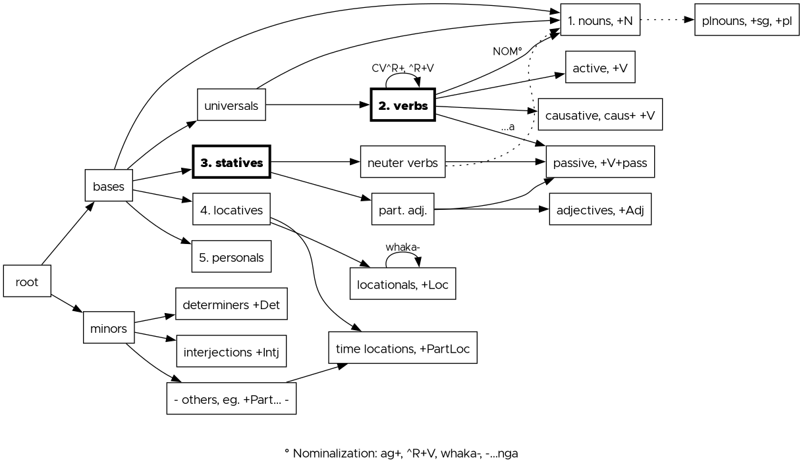

**Computational Morphology, Summer 2026**
## Māori via xfst

This project generates Māori words as compositions of morphemes, bounded by constraints. It is focusing on verbs/universals to demonstrate Xfst (Xerox finite-state tool) functionality on the one hand, and on a adequate coverage of common words on the other hand. 

### Description

Modeled are actual words as **lower words** like *'whakarunga'* (upwards, towards the top) and as corresponding **upper words** their lexical form, as an abstract representation. In this example, *'caus+runga+Loc'* denotes the *whaka-* causative on the locational *runga* (up, on top). 

### Requirements
* xfst Software (e.g. Kenneth R. Beesley and Lauri Karttunen. Finite State Morphology. CSLI Studies in Computational Linguistics. 2003, formerly http://fsmbook.com) 
* editor and console, e.g. Kate
* Python (optional, to validate/perform qs checks)

### Project Structure
```text
├── README.md       short intro
├── data/...        test data
├── docs/...        documentation
└── src/            .xfst source files
    ├── blocks/...  BuildingBlocks
    ├── maori.xfst
    ├── maori-guesser.xfst
    └── maori-lexc.xfst
```
### Installation and Usage
Place these files (e.g. via `git clone https://github.com/marievk/maori-xfst/`) ideally in the same local folder as the xfst software. 

Navigate to the target location (eg. via `cd` in Linux), start xfst and call the main file maori.xfst, which is the main entry point of this project (additional files should remain at the paths specified in the project structure): 

```bash
./xfst
source maori.xfst
```

After loading the entry-point, the project is running. Default output are lower words, followed by upper words. Both lists are sorted alphabetically. Other standard-outputs can be found in maori.xfst. These lines could be uncommented via removing the trailing `!`. 

### Overview 
The following branching structure has been created (simplified representation): 
 

### Known Limitations
* Scope focuses on verbal morphology (including the neigbouring word classes universals and statives). 
* Just some test data is available in this repo for copyright reasons.

### References 
The [Te&nbsp;Aka&nbsp;Māori](https://maoridictionary.co.nz) online dictionary was used as gold standard. Furthermore, examples were mainly taken from: 
* Suzanne Aubert. New and Complete Manual of Maori Conversation. Wellington, 1885.
* Mary Boyce. A Corpus of Modern Spoken Māori. PhD thesis, Te Herenga Waka-Victoria University of Wellington, 2006. 
* Kahikatoa Takimoana Harawira. Teach Yourself Maori. Reed, 2. ed., reprint. edition, 1974. 
* Apirana Ngata. Complete Manual of Maori Grammar and Conversation with Vocabulary. AMS Press, reprint 1979.

### License
This project is licensed under the
[Creative Commons Attribution-NonCommercial-ShareAlike 4.0 International License](https://creativecommons.org/licenses/by-nc-sa/4.0/) (CC BY-NC-SA 4.0).

Marie Vangerow-Kühn, hhu Düsseldorf, Summer 2026 
